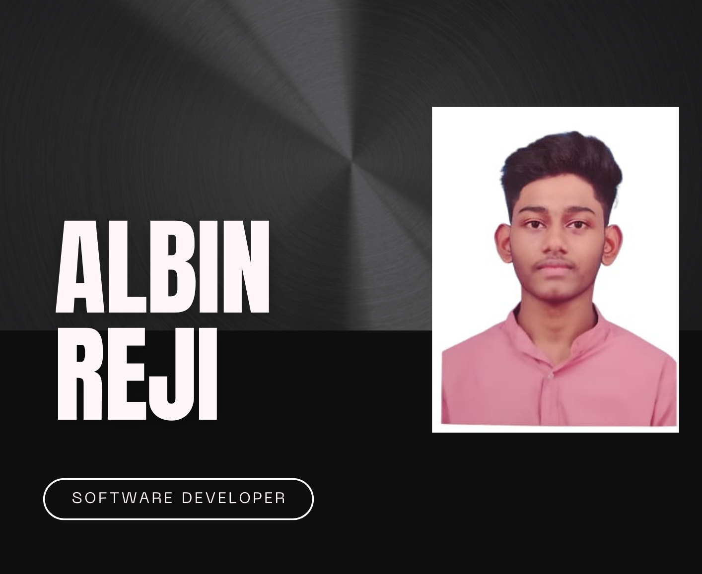

# Albin Reji - Software Developer

  
  
📧 **albinrejim30@gmail.com**  

---

## 👨‍💻 About Me

I am a **Computer Science & Engineering student** with a passion for web development, machine learning, and blockchain technologies. Currently in my third year at the **Mangalore Institute of Technology & Engineering**, I have worked on various projects and internships that have honed my skills in backend development and data science.

I’m constantly seeking opportunities to grow, learn, and apply my skills to solve real-world problems.

---

## 🛠️ Skills

- **Languages**: 
   
   
  
  
- **Frameworks**:
  
   
  
  
- **Web Development**: 
   
  

- **Databases**:
  
  
   
  

- **Tools**:
  
  
  
  
   
  

---

## 🌟 Projects

### 1. [AI-Powered Chat Application]
**Technologies**:Spring Boot (Microservices), ReactJS, PostgreSQL, MongoDB
**Role**: Lead Full Stack Developer
Developed a secure real-time chat application with Spring Boot microservices and ReactJS frontend. Implemented JWT, OAuth 2.0, Spring Security, and Eureka Service Registry to enable smooth user login, routing, and messaging.

---
### 2. [Virtual Time Capsule Application](https://github.com/Albin-Reji/virtual_time_capsule)
**Technologies**:Spring Boot, Spring Security, Spring Scheduling, PostgreSQL, JSP  
**Role**: Lead Full Stack Developer 
Created a web application to schedule messages for later delivery with user authentication. Used JWT and Spring Security for secure access, and Spring Scheduling for time-based automation. Backend functionality built with PostgreSQL and dynamic display with JSP.

---
### 3. [CNN-Based Osteoporosis Detection Using Medical Imaging](https://github.com/Albin-Reji/Osteoporosis_detection)
**Technologies**:  Python, TensorFlow, Keras
**Role**: Machine Learning Developer
Developed a deep learning model with 96.72% accuracy for classifying osteoporosis from X-ray images. Utilized Transfer Learning and Attention Mechanisms for improved feature extraction and explainability.

---
### 4. [Digital Image Editing Application](https://github.com/Albin-Reji/Image-Editor)
**Technologies**: Python, Pillow, Django, SQLite  
**Role**: Lead Back-End Developer  
Built an image editing application where users can resize, crop, and apply filters to images with an intuitive interface using Python's Pillow library and Django framework.

---

### 5. Flipkart Price Tracker
**Technologies**: Python, BeautifulSoup, Requests, SMTP  
**Role**: Lead Back-End Developer  
Developed a price tracking system that scrapes product pages on Flipkart and sends automated email alerts to users when the price drops below a defined threshold.

---

### 6. Heart Attack Disease Prediction Model
**Technologies**: Python, Pandas, NumPy, Scikit-learn  
**Role**: Data Science Intern at Saara IT Solutions  
Developed a machine learning model to predict heart attack risk using patient data, with hands-on experience in data preprocessing and model evaluation.

---

## 🎓 Education

- **Bachelor of Engineering** (Computer Science & Engineering)  
  Mangalore Institute of Technology & Engineering  
  **CGPA**: 8.51 (2021 - 2025)

- **Senior Secondary (12th)** - KSEEB  
  **Percentage**: 86.83% (2019 - 2021)

- **Secondary School (SSLC)** - KSEEB  
  **Percentage**: 89.12% (2018 - 2019)

---

## 💼 Internships

**Data Science Intern**  
*Saara IT Solutions Pvt Ltd (October 2023 - November 2023)*  
Worked on predicting heart attack risks using machine learning models in Jupyter Notebook. Gained hands-on experience in data analysis, preprocessing, feature engineering, and model evaluation.

---
**Full Stack Development Intern**  
*Udupi Web Solutions (February 2025 - May 2025) *  
Worked on developing and deploying full-stack web applications using Spring Boot, ReactJS, PostgreSQL, and MongoDB. Gained experience with secure authentication (JWT, OAuth 2.0), microservices architecture, and cloud deployment. Contributed to projects like AI-powered chat applications and virtual time capsule apps.

---

## 🏅 Certifications

- **Python for Data Science, AI & Development** - IBM (2024)
- **Complete Machine Learning Course with Python** - Udemy
- **100 Days of Code: Complete Python Pro Bootcamp** - Udemy
- **RPA Developer Foundation** - UiPath
- **Basics of Python** - Infosys

---

## 🎯 Hobbies & Interests

- **Programming**: Actively participating in coding challenges and hackathons to improve problem-solving skills.
- **Movies**: Enjoying films and documentaries, especially those related to technology and artificial intelligence.

---

## 📞 Contact Me

Feel free to reach out for any inquiries, collaborations, or opportunities!  
📧 **Email**: albinrejim30@gmail.com  
🔗 [LinkedIn](https://www.linkedin.com/in/albin--reji/) | [GitHub](https://github.com/Albin-Reji)

---

## 📄 Resume

[Download my resume](albinreji_resume.pdf)

<!--  -->
